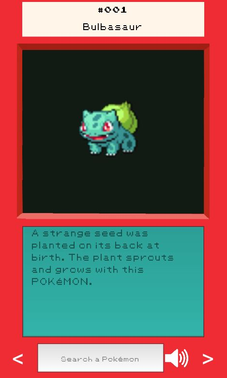

# Pokedex App
This project is a simple Pokédex that displays all the available sprites, entries and cries from
Pokémon from Gen1 to Gen8.

 &emsp; &emsp; &emsp;


## Use guide

To pass between Pokémon click on the arrows in each side at the bottom.

To view the different sprites, click the sprite screen. (black screen)
By clicking the right side of the screen, the sprites will advance in one direction. By clicking on the left
the sprites will change in the opposite direction.

To see the different entries, click on the entry screen. (turquoise screen)

To search for a specific Pokémon, click on the search bar and type the name or the number.

To play the Pokémon cry click on the sound icon
## Running it
To run this app, first unzip the multiple zip files in the resources folder by selecting 
all the .z01, .z02,..., z10 and .zip files. A .db file should appear in the directory called
pokedex.db

Once this file is uncompressed, run the following to create and use a virtual environment and install
the requirements:

```
python -m venv venv
source venv/Scripts/activate
pip install -r requirements.txt
```

After that, run the app by doing:

```
python main.py
```


